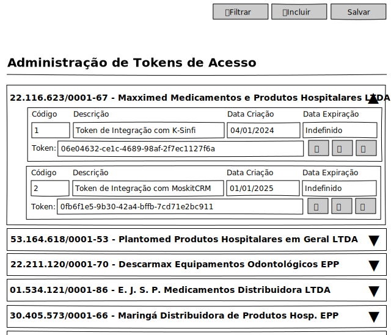

# Administração de Tokens - Mockup

## View

## Ações
|Nome|Tipo de Controle|Descrição|
|---|:---:|---|
|**Filtrar**|Botão|Aciona o Modal de Filtro do módulo Administração de Tokens|
|**Incluir**|Botão|Aciona o Modal de Inclusão do módulo Administração de Tokens|
|**Salvar**|Botão|Grava a informação alterada na linha registro aberto|

## Controles
|Nome|Tipo de Controle|Descrição|Obrigatório|Tamanho Max.|Validação|
|---|:---:|:---:|:---:|---|---|
|Código|Identidade|Identifica o registro|AUTO|-|-|
|Descrição|Caixa de Texto|Descrição do acesso ao Token|SIM|255|-|
|Token|Caixa de Texto|Chave do Token de acesso|SIM|64|Validação de Hash64|
|Data de Criação|Caixa de Texto|Data de Criação do Token|SIM|-|Validação da data Atual da Criação|
|Data de Expiração|Caixa de Texto|Data de Expiração do Token|NÃO|-|-|

# Tokens de Empresa

## Ações
|Nome|Tipo de Controle|Descrição|
|---|:---:|---|
|**Copiar**|Botão|Copia a informação do campo Token|
|**Atualizar**|Botão|Gera um novo Token no campo Token|
|**Excluir**|Botão|Excluir o Token existente no campo Token|

## Controles
|Nome|Tipo de Controle|Descrição|Obrigatório|Tamanho Max.|Validação|
|---|:---:|:---:|:---:|---|---|
|▾▴|Botão|Expande ou Recolhe o registro da Empresa|SIM|-|-|
