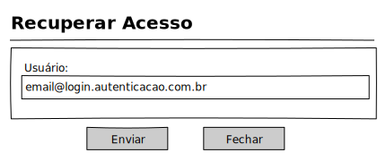
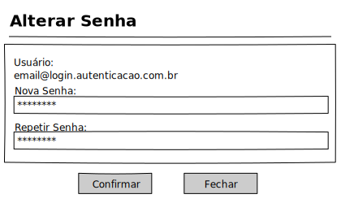

# Autenticação - Mockup

## View

## Ações
|Nome|Tipo de Controle|Descrição|
|---|:---:|---|
|**Acessar**|Botão|Aciona a Autenticação do Sistema|

## Controles
|Nome|Tipo de Controle|Descrição|Obrigatório|Tamanho Max.|Validação|
|---|:---:|---|:---:|:---:|:---:|
|Usuário|Caixa de Texto|Login e/ou e-mail do usuário cadastrado|SIM|255|Validação de login e/ou e-mail de acesso|
|Senha|Caixa de Texto|Senha do login e/ou e-mail de acesso|SIM|64|Validação de senha, de acordo com o login e/ou e-mail informado para acessos|
|Recuperar Senha|Hyperlink|Será redirecionado a tela de Recuperar senha|NÃO|255|-|

# Autenticação - Recuperar Senha

## View

## Ações
|Nome|Tipo de Controle|Descrição|
|---|:---:|---|
|**Enviar**|Botão|Enviar solicitação de recuperação de acesso|
|**Fechar**|Botão|Retorna a tela de Acesso/Autenticação|

## Controles
|Nome|Tipo de Controle|Descrição|Obrigatório|Tamanho Max.|Validação|
|---|:---:|---|:---:|:---:|:---:|
|Usuário|Caixa de Texto|Login e/ou e-mail do usuário cadastrado|SIM|255|Validação de login e/ou e-mail de acesso|

# Autenticação - Alterar Acesso

## View

## Ações
|Nome|Tipo de Controle|Descrição|
|---|:---:|---|
|**Confirmar**|Botão|Confirma a alteração da senha de acesso|
|**Fechar**|Botão|Retorna a tela de Acesso/Autenticação|

## Controles
|Nome|Tipo de Controle|Descrição|Obrigatório|Tamanho Max.|Validação|
|---|:---:|---|:---:|:---:|:---:|
|Usuário|Texto|Login e/ou e-mail do usuário cadastrado|AUTO|255|-|
|Nova Senha|Caixa de Texto|Informar a nova senha a ser alterada|SIM|64|-|
|Repetir Senha|Caixa de Texto|Repetir a nova senha a ser alterada|SIM|64|Deve ser identica a senha informada no campo Nova Senha|

