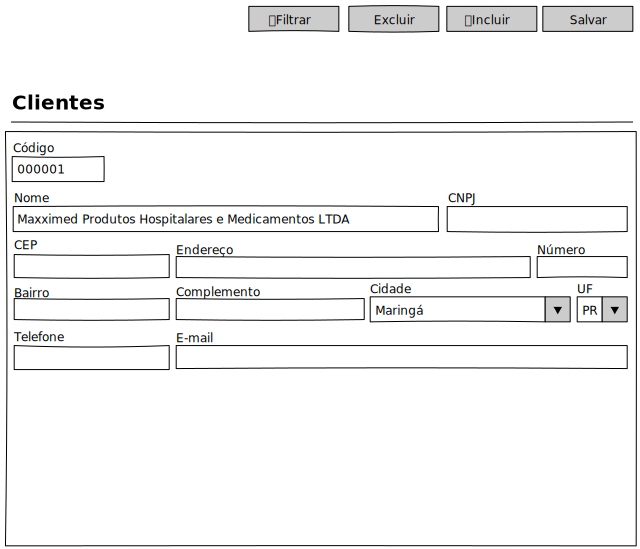

# Clientes - Mockup

## View

## Ações
|Nome|Tipo de Controle|Descrição|
|---|:---:|---|
|**Filtrar**|Botão|Aciona o Modal de Filtro do módulo Clientes|
|**Excluir**|Botão|Exclui um registro no módulo Clientes|
|**Incluir**|Botão|Inclui um registro no módulo Clientes|
|**Salvar**|Botão|Salva um registro do módulo Clientes|

## Controles
|Nome|Tipo de Controle|Descrição|Obrigatório|Tamanho Max.|Validação|
|---|:---:|:---:|:---:|---|---|
|Código|Identidade|Identifica o registro|AUTO|-|-|
|Nome|Caixa de Texto|Nome/Razão Social do cliente|SIM|255||
|CNPJ|Caixa de Texto|CNPJ do cliente|SIM|14|Validação do CNPJ|
|Endereço|Caixa de Texto|Endereço do cliente|SIM|255||
|Cidade|Caixa de Seleção|Cidade do cliente|SIM|-|Cidade deve pertencer a UF|
|UF|Caixa de Seleção|UF da cidade do cliente|SIM|-|UF deve estar vinculada à cidade|
|Telefone|Caixa de Texto|telefone principal do cliente|SIM|20|-|