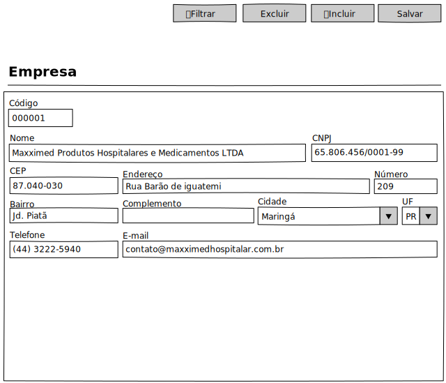

# Empresas - Mockup

## View

## Ações
|Nome|Tipo de Controle|Descrição|
|---|:---:|---|
|**Filtrar**|Botão|Aciona o Modal de Filtro do módulo Empresas|
|**Excluir**|Botão|Exclui um registro no módulo Empresas|
|**Incluir**|Botão|Inclui um registro no módulo Empresas|
|**Salvar**|Botão|Salva um registro do módulo Empresas|

## Controles
|Nome|Tipo de Controle|Descrição|Obrig.|Tam. Max.|Validação|
|---|:---:|---|:---:|:---:|:---:|
|Código|Identidade|Identifica o registro|AUTO|-|-|
|Nome|Caixa de Texto|Nome/Razão Social da Empresas|SIM|255||
|CNPJ|Caixa de Texto|CNPJ da Empresas|SIM|14|Validação do CNPJ|
|CEP|Caixa de Texto|CEP do Endereço da Empresas|SIM|10|Deve preencher demais campos do endereço|
|Endereço|Caixa de Texto|Endereço da Empresas|SIM|255||
|Número|Caixa de Texto|Número do Logradouro da Empresas|SIM|16||
|Bairro|Caixa de Texto|Bairro do endereço da Empresas|SIM|255||
|Complemento|Caixa de Texto|Complemento do endereço da Empresas|NÃO|255||
|Cidade|Caixa de Seleção|Cidade da Empresas|SIM|255|Cidade deve pertencer a UF|
|UF|Caixa de Seleção|UF da cidade da Empresas|SIM|2|UF deve estar vinculada à cidade|
|Telefone|Caixa de Texto|telefone principal da Empresas|SIM|20|-|
|E-mail|Caixa de Texto|E-mail principal da Empresas|SIM|255||