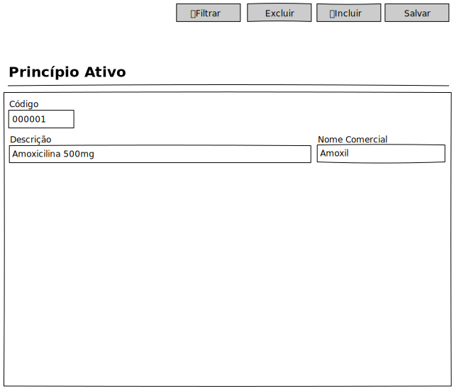

# Princípio Ativo - Mockup

## View

## Ações
|Nome|Tipo de Controle|Descrição|
|---|:---:|---|
|**Filtrar**|Botão|Aciona o Modal de Filtro do módulo Princípio Ativo|
|**Excluir**|Botão|Exclui um registro no módulo Princípio Ativo|
|**Incluir**|Botão|Inclui um registro no módulo Princípio Ativo|
|**Salvar**|Botão|Salva um registro do módulo Princípio Ativo|

## Controles
|Nome|Tipo de Controle|Descrição|Obrigatório|Tamanho Max.|Validação|
|---|:---:|---|:---:|:---:|:---:|
|Código|Identidade|Identifica o registro|AUTO|-|-|
|Descrição|Caixa de Texto|Descrição completa do Princípio Ativo|SIM|2024|-|
|Nome Comercial|Caixa de Texto|Descrição Comercial do Princípio Ativo|SIM|255|-|