# Usuário - Mockup

## View

## Ações
|Nome|Tipo de Controle|Descrição|
|---|:---:|---|
|**Filtrar**|Botão|Aciona o Modal de Filtro do módulo Usuário|
|**Excluir**|Botão|Exclui um registro no módulo Usuário|
|**Incluir**|Botão|Inclui um registro no módulo Usuário|
|**Salvar**|Botão|Salva um registro do módulo Usuário|

## Controles
|Nome|Tipo de Controle|Descrição|Obrigatório|Tamanho Max.|Validação|
|---|:---:|---|:---:|:---:|:---:|
|Código|Identidade|Identifica o registro|AUTO|-|-|
|Redefinir Senha|Botão|||||
|Login|Caixa de Texto|Login do Usuário|SIM|32|-|
|Nome|Caixa de Texto|Nome do Usuário|SIM|255|-|
|E-mail|Caixa de Texto|E-mail do Usuário|SIM|255|E-mail valido|

# Empresas do Usuário

## Ações
|Nome|Tipo de Controle|Descrição|
|---|:---:|---|
|**➕**|Botão|Inclui um registro no módulo Usuário|
|**❌**|Botão|Salva um registro do módulo Usuário|

## Controles
|Nome|Tipo de Controle|Descrição|Obrigatório|Tamanho Max.|Validação|
|---|:---:|---|:---:|:---:|:---:|
|Código|Caixa De Texto|Ao informar um código e clicar no botão "..." o sistema irá buscar empresa de acordo com o código informado|NÃO|-|-|
|⋯|Botão|Modal para buscar Empresa caso informado código, ou empresa|SIM|-|-|
|Empresa|Caixa de Texto|Ao informar uma descrição de empresa, e clicar no botão "..." o sistema irá buscar empresa de acordo com a descrição informada|NÃO|-|-|
|-|Tabela|Empresas vinculadas ao usuário|SIM|-|<ol><li>Código</li><li>Empresa</li></ol>|
