# Anúncios - Mockup

## View

## Ações
|Nome|Tipo de Controle|Descrição|
|---|:---:|---|
|**Filtrar**|Botão|Aciona o Modal de Filtro do módulo Clientes|
|**Excluir**|Botão|Exclui um registro no módulo Clientes|
|**Incluir**|Botão|Inclui um registro no módulo Clientes|
|**Salvar**|Botão|Salva um registro do módulo Clientes|

## Controles
|Nome|Tipo de Controle|Descrição|Obrig.|Tam. Max.|Validação|
|---|:---:|---|:---:|:---:|---|
|Código|Identidade|Identifica o registro|AUTO|-|-|
|Nome|Caixa de Texto|Nome/Razão Social do cliente|SIM|255||