# Anúncios - Mockup

## View

## Ações
|Nome|Tipo de Controle|Descrição|
|---|:---:|---|
|**Interesses**|Botão|Exibe o formulário de interesses vinculados ao anúncio.|
|**Filtrar**|Botão|Aciona o Modal de Filtro do módulo Anúncio|
|**Excluir**|Botão|Exclui um registro no módulo Anúncio|
|**Incluir**|Botão|Inclui um registro no módulo Anúncio|
|**Salvar**|Botão|Salva um registro do módulo Anúncio|

## Controles
|Nome|Tipo de Controle|Descrição|Obrig.|Tam. Max.|Validação|
|---|:---:|---|:---:|:---:|---|
|Código|Identidade|Identifica o registro|AUTO|-|-|
|Data Cadastro|Caixa de Texto|Data de cadastro/lançamento do anúncio|AUTO/SIM|21|Campo de Data/Hora DD/MM/YYYY HH:mm:ss|
|Data Expiração|Caixa de Texto|Data de expiração do anúncio|NÃO|21|Campo de Data/Hora DD/MM/YYYY HH:mm:ss|
|Reserva Saldo|Check|Habilita se os anúncios reservarão saldo|NÃO|-|-|
|Permite acessar Inf. no Interesse|Check|Permite acessar dados do anunciante pelo interessado|NÃO|-|-|
|Remove Anúncio Após Expiração|Check|Caso preenchido Data Expiração, anúncio é removido após expirado|NÃO|-|-|
|Total Anúncio|Caixa de Texto|Exibe o valor total do anúncio|AUTO/SIM|-|Campo Numérico #,#####0.0000|

# Produtos do Anúncio

## Controles
|Nome|Tipo de Controle|Descrição|Obrig.|Tam. Max.|Validação|
|---|:---:|---|:---:|:---:|---|
|Código|Caixa de Texto|Código do Produto|SIM|6|-|
|⋯|Botão|Abre a caixa de seleção de produtos|-|-|-|
|Descrição|Caixa de Texto|Descrição do Produto|AUTO|255|-|
|Itens do Anúncio|Tabela|Lista os produtos do anúncio|-|-|<ol><li>Código Produto</li><li>Descrição do Produto</li><li>Marca</li><li>Princípio Ativo</li><li>Un</li><li>Qtde.</li><li>Valor Un</li><li>Valor Total</li></ol>|

# Interessados do Anúncio

## View

## Ações
|Nome|Tipo de Controle|Descrição|
|---|:---:|---|
|**❌**|Botão|Fecha o Modal Interessados do Anúncio|

## Controles
|Nome|Tipo de Controle|Descrição|Obrig.|Tam. Max.|Validação|
|---|:---:|---|:---:|:---:|---|
|Interesses|Tabela|Lista os dados de interesses do anúncio|-|-|<ol><li>Código Empresa</li><li>Razão Social</li><li>Total do Interesse</li></ol>|
|Itens do Interesse|Tabela|Lista os produtos de cada interesse|-|-|<ol><li>Código Produto</li><li>Descrição do Produto</li><li>Marca</li><li>Un</li><li>Qtde.</li><li>Valor Un</li><li>Valor Total</li></ol>|
|Visualizar|Botão|Acessa os dados do Interesse do anúncio|-|-|-|
|▾▴|Botão|Expande ou recolhe o registro do Interesse do anúncio|-|-|-|