# Produto - Mockup

## View

## Ações
|Nome|Tipo de Controle|Descrição|
|---|:---:|---|
|**Filtrar**|Botão|Aciona o Modal de Filtro do módulo Produto|
|**Excluir**|Botão|Exclui um registro no módulo Produto|
|**Incluir**|Botão|Inclui um registro no módulo Produto|
|**Salvar**|Botão|Salva um registro do módulo Produto|

## Controles
|Nome|Tipo de Controle|Descrição|Obrigatório|Tamanho Max.|Validação|
|---|:---:|---|:---:|:---:|:---:|
|Código|Identidade|Identifica o registro|AUTO|-|-|
|Descrição|Caixa de Texto|Descrição do Produto|SIM|255|-|
|Estoque|Caixa de Texto|Estoque Total levando em consideração as quantidades dos lotes|SIM|-|-|
|Princípio Ativo|Caixa de Seleção|Princípio Ativo do Produto|SIM|255|-|
|Marca/Laboratório|Caixa de Seleção|Marcas dos Laboratórios do Produto|SIM|-|-|
|Unidade de Medida|Caixa de Seleção|Unidades de Medidas do Produto|SIM|-|-|
|Botão Novo|Botão|Abre a tela de Cadastro de Lotes do produto|NÃO|-|-|